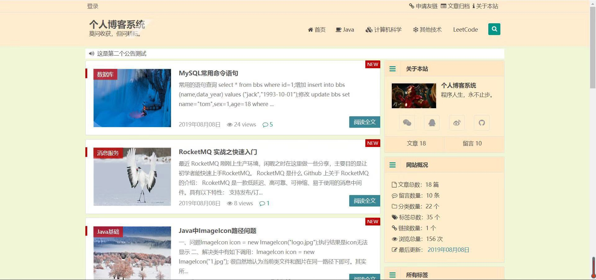
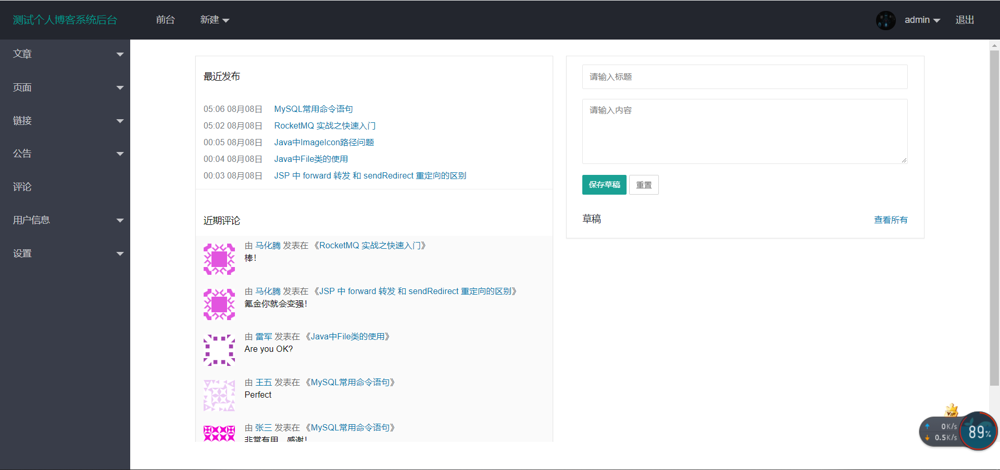

# SSM Blog

## Table of Contents

  - [Background](#background)
  - [Install](#install)
  - [Usage](#usage)
  - [Functions](#Functions)
  - [Contributing](#contributing)
  - [License](#license)

## Background

This is a personal blogging system based on the SSM (Spring+Spring MVC+Mybatis)  framework, which is an internship project.

## Install

This project uses Maven and Lombok. Go check them out if you don't have them locally installed.

## Usage
1.	下载Intellij IDEA 2019版本，数据库为MySQL 8.0，tomcat为8.0。
2.	根据[百度](https://www.cnblogs.com/xihehua/p/9639045.html)的步骤配置Maven，下载最新版本就好，记得加环境变量。
3.	根据[百度](https://jingyan.baidu.com/article/0a52e3f4e53ca1bf63ed725c.html)在IDEA下载安装Lombok插件，有这个插件可以自动生成getter and setter，源码中就不需要写了。
4.	在IDEA导入项目，以Maven形式导入。
5.	压缩包有以下三个部分：
 - Forest Blog: 完整项目源码，可以使用IDEA导入或者打开。
 - uploads: 上传图片的目录，可以与源码分离开来，可以放到物理磁盘某一目录。  
 - forest_blog.sql: 数据库文件，请先创建数据库，然后以运行sql文件方式导入。
6.	新建数据库forest_blog，导入数据库（即forest_blog.sql）。注意，数据库的编码和排序规则是utf-8和utf-8_general_ci。数据库默认用户名root，密码 123456。
7.	修改db.properties文件，在src/main/resources中里面有MySQL，请确保已安装和启动MySQL。注意修改数据库地址、用户名和密码。
8.	根据项目提示，修改数据库配置和tomcat配置，注意在tomcat上部署Forestblog war_exploded的时候，applicationcontext要改为/（原本会是Forestblog/），在之后。
1. 该项目中，文件上传是传到本地，且和项目文件夹不在一起，就是说是源码和上传目录是分离的。比如我们把 uploads 目录放到D盘根目录，比如有一张图片路径是D:/uploads/2019/08/avatar.jpg，我们想在项目中以(http://loclahost:8080/uploads/2019/08/avatar.jpg)方式访问，需要以下两步：
    - 修改 UploadFileController.java 中上传路径，需要修改 rootPath 为你指定的 uploads 目录，如String rootPath ="E:/uploads/";
    - 给IDEA设置静态资源映射，在tomcat配置中 Deployment 里面添加，将uploads的artifact处改为external sources，换为uploads所在文件夹。

## Functions
项目采用Spring+Spring MVC+Mybatis框架，使用Maven进行项目依赖构建，前台前端采用CSS样式，后台前端采用Layui。个人博客系统有以下功能：
  - 文章功能：
    - 文章：写文章、写草稿、修改文章、查找文章、删除文章。
    - 分类：设置一级分类、二级分类，可以对分类进行增删改查，并将文章进行分类。
    - 标签：对标签进行增删改查，并给文章贴标签。
  - 页面功能：后台给前台增加页面，页面链接需在链接设置中进行添加后方能通过前台访问。
  - 链接功能：对链接进行增删改查。
  - 公告功能：对公告进行增删改查，前台上方将滚动播放公告。
  - 评论功能：游客可以进行评论，博主可以回复，并对不良言论进行删除。
  - 用户信息：后台设置个人信息和修改密码。
  - 菜单设置：对前台上方的菜单进行增删改查。 
  
  效果图：  
  前台效果：  
    
  后台登录：  
    
  后台控制台：  
    
  后台写文章：  
    
  后台增加页面：  
    
  

## Contributing
Feel free to dive in! Open an issue or submit PRs.

### Contributors

This project exists thanks to all the people who contribute. 
 - [YuhsiHu](https://github.com/YuhsiHu)
 - [longxianghe](https://github.com/longxianghe)
 - Zhongchang Guo

## License

[MIT](LICENSE) © YuhsiHu